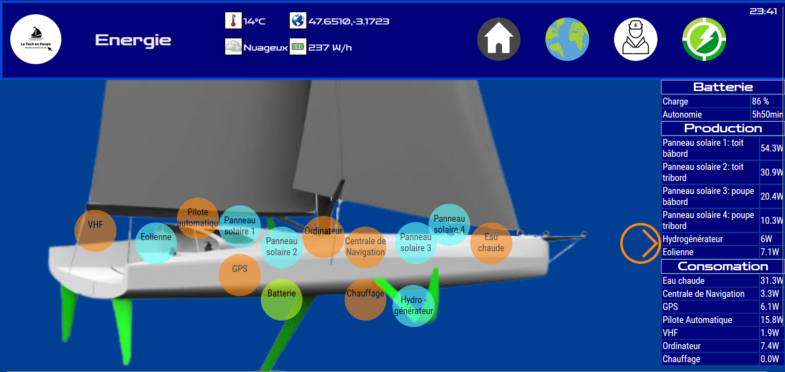
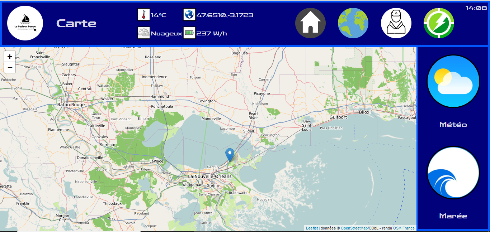
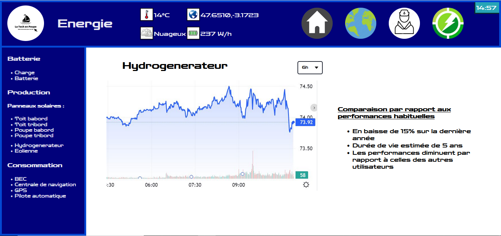

# The Tech en Poupe

## Table of Contents

1. [General Info](#general-info)
2. [Installation](#installation)
3. [How it works](#how-it-works)
4. [Technologies](#technologies)
5. [The Team](#the-team)
6. [Suggested improvement](#suggested-improvement)

## General Info

---

The Tech en Poupe is a website created by a group of 4 students following a UCD course (User-Centered Design).
The goal is to have an interface usable on a boat to have access to its energy consumption and production, a map, the weather, the tides etc...

### Screenshot

---




## Installation

---

A little intro about the installation.

```
$ git clone https://git.enib.fr/t9capita/web_groupe_2.git
$ cd ../path/to/the/file
```

You will see a listing of folder — click the HTML file you want to run.
Here : index.html

**NOTE**
Git must be installed on your computer !

### How it works

---

It is a classic website, you can go from page to page, bring up menus etc...
There are 4 separate but complementary pages :

-   The ship's energy map (index.html)
-   Graphics (energy.html)
-   A map of the world + weather + tides (map.html)
-   The interface dedicated to the jacket (jacket.html)

## Technologies

---

A list of technologies used within the project:

-   [HTML5](https://fr.wikipedia.org/wiki/HTML5): Version 5.2
-   [CSS](https://fr.wikipedia.org/wiki/Feuilles_de_style_en_cascade): Version 3.??
-   [JavaScript](https://fr.wikipedia.org/wiki/JavaScript): Version 11 - ES2020

## The Team

---

-   Théo Capitaine, Developer: t9capita@enib.fr
-   Mathis Moizant, Developer: m9moizan@enib.fr
-   Maëlle Le Quement, Developer: m9lequem@enib.fr
-   Marie Le Bris, Developer: m7lebris@enib.fr

We are four 4th year students at the National Engineering School of Brest (ENIB).
As part of our studies, we have been led to develop a web application

## Suggested improvement

---

We can work on site design and ergonomics.
